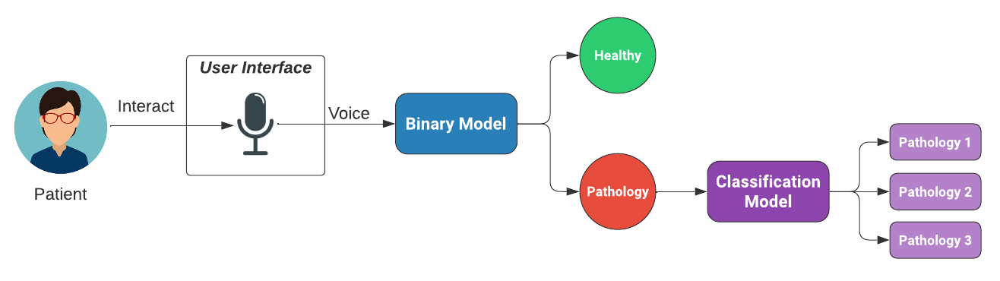

# Voice Pathology Detection

Graduation project for Ain shams Scientific Computing general program, The publication of our paper "Analysis of Deep Learning Models for Voice Pathology detection "
on IEEE Explore, you can check it out [here](https://ieeexplore.ieee.org/document/10391118)

## Table of Contents

- [Introduction](#introduction)
- [Team Members](#team-members)
- [System Architecture](#system-architecture)
- [Technologies Used](#technologies-used)
- [Dataset](#dataset)
- [Preprocessing](#preprocessing)
- [Feature Extraction](#feature-extraction)
- [Binary Model Architecture](#binary-model-architecture)
- [Results](#results)
- [Classification Model Architecture](#classification-model-architecture)
- [Results](#results)
- [Interface Screenshots](#interface-screenshots)
- [Demo](#demo)
- [Acknowledgements](#acknowledgements)

## Introduction

Our graduation project, **Voice Pathology Detection**, is a program designed to diagnose the health of a person's voice and classify voice disorders using both Machine Learning (ML) and Deep Learning (DL) techniques.

The human voice is a powerful tool for communication, but voice disorders can significantly impact a person's ability to communicate effectively. Early detection of voice pathologies is crucial for timely intervention and appropriate treatment. Our project aims to provide a valuable tool for identifying voice disorders by analyzing audio recordings of voice samples.

We leveraged the power of ML and DL algorithms to develop a model capable of distinguishing between healthy and pathological voice characteristics. By utilizing these advanced techniques, we sought to create a reliable and accurate system that could aid in the early diagnosis of voice disorders, potentially improving the quality of life for individuals affected by such conditions.

Throughout the development process, we focused on creating an intuitive and user-friendly interface that allows users to upload audio samples for analysis. The system then performs a comprehensive assessment, providing valuable insights into the health of the voice and identifying any potential voice pathologies.

By combining the fields of ML and DL, our graduation project aims to contribute to the field of voice pathology detection, supporting healthcare professionals and individuals alike in understanding and addressing voice disorders.

## Team Members

Team Members who contributed to this project:

- [Ahmed Osama](https://github.com/ahmedosama-eng)
- [Abdalla Osama](https://github.com/DalaOsos)
- [Manal Gerges](https://github.com/ManalGergesZaky)

- [Sara Mohammed](https://github.com/saramohamed55)
- [Adham Ahmed](https://github.com/AdHam14a)
- [Ahmed Khaled](https://github.com/ahmads1990)

## System Architecture

## Technologies Used
- Python
- Librosa
- Keras
- TensorFlow
- Pyqt5
- Sqlite3
- NumPy
- Pandas

## Dataset

we utilized the **Saarbrucken database (SVD)**  to train and evaluate the model.
SVD is german database contains a collection of voice recordings from individuals with and without voice pathologies. It contains audio samples of various durations and different types of voice disorders. Recorded as **Sessions**

#### Session Details:
1. Vowels /i, a, u/ produced at normal, high, and low pitch; 
2. Vowels /i, a, u/ with rising–falling pitch; and 
3. Sentence “Guten Morgen, wie geht es Ihnen?” (“Good morning, how are you?”). 

## Preprocessing

**Data Augmentation**
- **Time Domain**
    - Time shift 
    - Add Noise
- **Frequency Domain**
    - Frequency mask 
    - Time mask

## Feature Extraction
**Mel Spectrogram**

## Binary Model Architecture
**VGG19**

## Results

## Classification Model Architecture
**Multiple Experiments were used**
1.Binary model with Softmax output Layer
2.One-vs-All classification approach
3.Using machine learning models
4.Transfer learning pre-trained transformer model (Highest Accuracy)
### AST

## Results

## Interface Screenshots
### Register Page

### Recording Page

## Demo
check out our project in action! Watch the video demonstration below:

https://github.com/ahmads1990/Voice-pathology-detection/assets/54421982/d9954324-2337-4ef6-a915-29a44351d06e

## Acknowledgements

Special thanks to Teaching staff of Ain shams university **Prof. Dr. Hala Mosheir**, **T.A. Mohammed Essam**, **T.A. Rezk Mohammed** for their guidance and support throughout this project. Additionally, we acknowledge the creators of the **Saarbrucken database (SVD)** for making their data publicly available.
